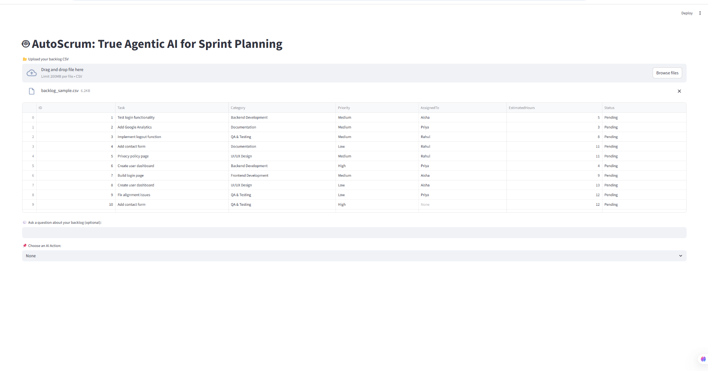

# AutoScrum — Agentic AI Sprint Planner (Streamlit + LangChain)

    

A **multi-agent Scrum assistant** that reads a backlog CSV and produces:
- a **2-week sprint plan** (working-days aware),
- a **risk report**, and
- a **final sprint summary** — using **memory-enabled agents** and prompt templates.

> **Agents collaborate. The user decides. Output stays explainable and reviewable.**

---

## Architecture


### Mermaid Architecture Diagram (Source)

```mermaid
graph TB

%% ===== Nodes =====
subgraph Frontend_Layer
UI["Streamlit UI<br>Upload Backlog CSV<br>Ask Question and Choose Action"]
PM["Project Manager<br>Final User"]
UI --> PM
end

subgraph Processing_Layer
Upload["CSV Upload"]
Load["Load Backlog<br>pandas read_csv"]
Format["Format Backlog as Text"]
Action["Action Selector<br>Sprint Risk Summary General"]
Upload --> Load --> Format --> Action
end

subgraph Governance_Layer
Gate["Execution Gate<br>Check Sprint Plan Exists"]
Decision{"Which Action"}
LLMCall["LLM Invocation<br>ChatOpenAI GPT-4"]
Agents["Agents<br>SprintPlanner RiskDetector ReportGenerator"]
Action --> Gate --> Decision
Decision -->|General| LLMCall
Decision -->|Sprint| Agents
Decision -->|Risk| Agents
Decision -->|Summary| Agents
Agents --> LLMCall
end

subgraph Data_Layer
State[(Session State<br>sprint_plan)]
Prompts[(Prompt Files<br>sprint risk report)]
Backlog[(Backlog CSV Data)]
end

Format --> Backlog
Prompts --> Agents
Agents --> State
State --> Gate
LLMCall --> UI

%% ===== Colors =====
classDef frontend fill:#dbeafe,stroke:#1e40af,stroke-width:2px,color:#000;
classDef processing fill:#dcfce7,stroke:#166534,stroke-width:2px,color:#000;
classDef governance fill:#fef3c7,stroke:#92400e,stroke-width:2px,color:#000;
classDef data fill:#fce7f3,stroke:#9d174d,stroke-width:2px,color:#000;

class UI,PM frontend;
class Upload,Load,Format,Action processing;
class Gate,Decision,LLMCall,Agents governance;
class State,Prompts,Backlog data;
````

---

## Screenshots




---

## What It Does

### ✅ 1) Backlog Understanding (CSV → Text Context)

* Upload backlog CSV
* Convert rows into a compact text format for LLM reasoning
* Ask optional “general” questions about backlog

### ✅ 2) Agentic Actions (Choose One)

* **Sprint Planning Agent** → assigns tasks to working days with load balancing
* **Risk Detection Agent** → flags blockers, missing estimates/assignees, overloaded members, unclear requirements
* **Report Generator Agent** → writes a client-friendly sprint summary using sprint + risk context

### ✅ 3) Memory-Aware Conversations

* Uses `ConversationBufferMemory`
* Enables follow-up questions on outputs like: “Which tasks are biggest risk and why?”

---

## Tech Stack

* **Python**
* **Streamlit** (UI)
* **LangChain Core + Memory**
* **OpenAI ChatOpenAI (GPT-4 / GPT-4o)**
* **Pandas** (CSV ingestion)
* Prompt templates (`prompts/*.txt`)

---

## Quick Start

```bash
git clone https://github.com/<your-username>/<your-repo>.git
cd <your-repo>

python -m venv venv
# Windows:
venv\Scripts\activate
# Mac/Linux:
# source venv/bin/activate

pip install -r requirements.txt
streamlit run streamlit_app.py
```

---

## Configuration

Create a `.env` file in the project root:

```env
OPENAI_API_KEY=your_key_here
```

---

## Project Structure (Recommended)

```
AutoScrum/
├── agents/
│   ├── sprint_planner.py
│   ├── risk_detector.py
│   └── report_generator.py
├── prompts/
│   ├── sprint_prompt.txt
│   ├── risk_prompt.txt
│   ├── report_prompt.txt
│   └── prompt_loader.py
├── utils/
│   ├── load_data.py
│   └── question_router.py
├── assets/
│   ├── architecture.svg
│   ├── screenshot1.png
│   └── screenshot2.png
├── streamlit_app.py
├── requirements.txt
├── README.md
├── .env
└── .gitignore
```

---

## Impact (Hiring Signal)

This project demonstrates real-world agentic workflow design:

✅ Multi-agent orchestration (planner + risk + reporter)
✅ Memory-enabled multi-turn reasoning
✅ Prompt templating and dynamic date placeholders
✅ Gated execution flow (Risk/Summary depend on Sprint Plan)
✅ Practical PM automation: sprint plans, risk insights, executive summaries

This is not a static chatbot.
This is an **agentic workflow automation system** for project delivery.

---

## License

MIT

````

---

## 2 important notes (so GitHub auto-renders images)

1) **Make sure these files exist exactly** (case-sensitive):
- `assets/architecture.svg`
- `assets/screenshot1.png`
- `assets/screenshot2.png`

2) Then push:
```powershell
git add .
git commit -m "Add README + architecture + screenshots"
git push
````

---

If you want, I’ll also create your **architecture.svg from your Mermaid** so you don’t have to manually export it.
### 🚀 Live App: [Click here to try AutoScrum](https://autoscrum.streamlit.app/)

# 🤖 AutoScrum-AgenticAI

**AutoScrum-AgenticAI** is an enterprise-ready Agentic AI system that automates Sprint Planning, Risk Detection, and Summary Reporting for Agile delivery teams.

By integrating **LangChain agents**, **OpenAI GPT-4**, and **Streamlit**, this tool transforms raw backlog CSVs into intelligent sprint plans, risk reports, and executive-ready summaries — in minutes.

---

## 👥 Who Can Use This

This tool is ideal for:

- ✅ Scrum Masters & Agile Coaches
- ✅ Project & Delivery Managers
- ✅ Enterprise PMOs & L&D Teams
- ✅ GenAI Developers & AI Consultants
- ✅ Tech Trainers & Capability Building Programs

---

## ⏱️ Real Impact

| Task                          | Manual Time | With AutoScrum | Time Saved |
|------------------------------|-------------|----------------|------------|
| Sprint Planning              | 3–4 hrs     | 2–3 mins       | ⏱️ 95%     |
| Risk Detection               | ~2 hrs      | 1 min          | ⏱️ 97%     |
| Summary Report               | ~1 hr       | <1 min         | ⏱️ 98%     |

> ⚡ Save up to **8 hours per sprint**, reduce errors, and improve alignment.

---

## 🚀 Key Features

- 📂 Upload CSV backlog via Streamlit interface
- 🧠 LangChain agents with LLM memory (GPT-4)
- 📋 Sprint Plan Generator with working-day logic
- ⚠️ Risk Analyzer that detects blockers automatically
- 🧾 Summary Report Generator for stakeholders
- 💬 Follow-up Q&A with natural language support

---

## 🛠️ Tech Stack

| Layer       | Technology            |
|-------------|------------------------|
| LLM         | OpenAI GPT-4 via LangChain |
| Agents      | LangChain Memory Agents |
| Frontend    | Streamlit              |
| Input       | CSV Backlog            |
| Secrets     | `.env` & Streamlit Secrets |

---

## 🧪 Sample Backlog CSV Format

| Task ID | Title        | Description               | Priority | Status     |
|---------|--------------|----------------------------|----------|------------|
| 101     | Build Login  | Create user login module   | High     | To Do      |
| 102     | API Setup    | REST API for backend       | Medium   | In Progress|

