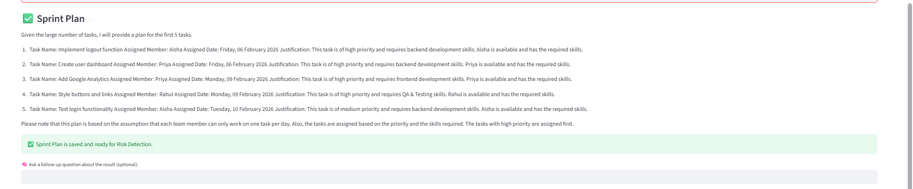
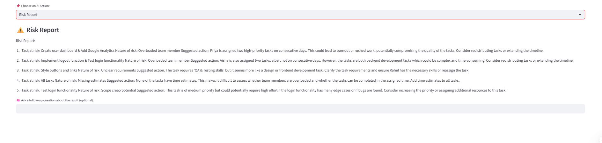
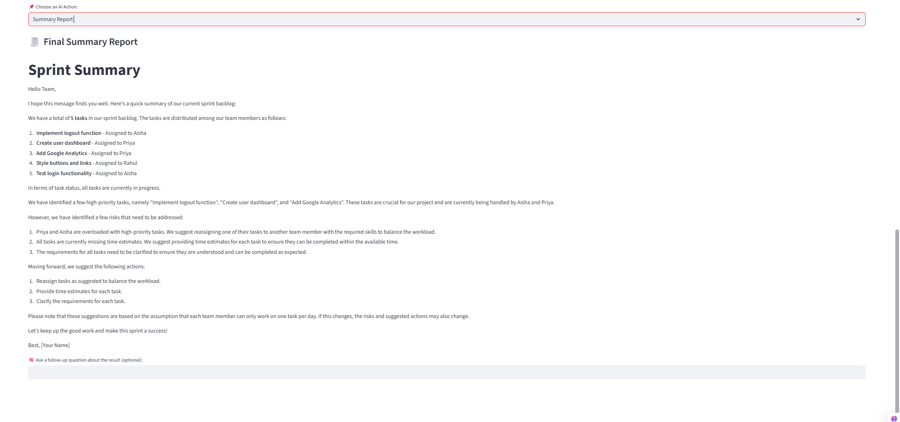

# AutoScrum — Agentic AI Sprint Planner (Streamlit + LangChain)


A **multi-agent Scrum assistant** that reads a backlog CSV and produces:

- a **2-week sprint plan** (working-days aware)
- a **risk report**
- a **final sprint summary**

using memory-enabled agents and prompt templates.

> **Agents collaborate. The user decides. Output stays explainable and reviewable**

---

## Architecture


---

## Screenshots

| | |
|-|-|
|  |  |
|  |  |
|  |  |

---

## What It Does

### ✅ 1) Backlog Understanding (CSV → Text Context)

- Upload backlog CSV
- Convert rows into compact text for AI reasoning
- Ask optional general questions about backlog

### ✅ 2) Agentic Actions

- **Sprint Planning Agent** → assigns tasks with workload balance
- **Risk Detection Agent** → finds blockers & overload
- **Report Generator Agent** → executive sprint summary

### ✅ 3) Memory-Aware Conversations

- Uses `ConversationBufferMemory`
- Enables follow-up reasoning

Example:

> “Which tasks are biggest risk and why?”

---

## Tech Stack

- Python
- Streamlit UI
- LangChain Core + Memory
- OpenAI GPT-4 / GPT-4o
- Pandas (CSV ingestion)
- Prompt templates

---

## Quick Start

```bash
git clone https://github.com/lavanya1402/AutoScrum-AgenticAI.git
cd AutoScrum-AgenticAI

python -m venv venv
venv\Scripts\activate

pip install -r requirements.txt
streamlit run streamlit_app.py
```

---

## Configuration

Create `.env` file:

```
OPENAI_API_KEY=your_key_here
```

---

## Project Structure

```
AutoScrum/
├── agents/
├── prompts/
├── utils/
├── assets/
│   ├── architecture.svg
│   ├── screenshot1.png
│   └── screenshot6.png
├── streamlit_app.py
├── requirements.txt
├── README.md
```

---

## This project demonstrates:

✅ Multi-agent orchestration  
✅ Memory-enabled reasoning  
✅ Prompt templating  
✅ Gated execution workflow  
✅ Real-world PM automation

This is **not a chatbot**.  
This is an **agentic workflow system**.

---

## License

MIT
